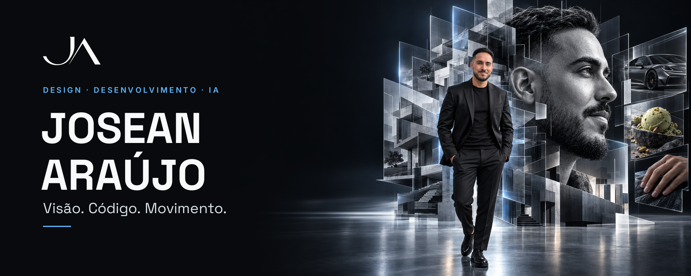
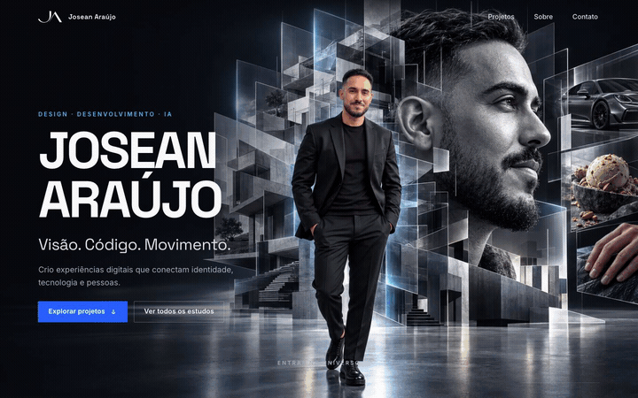
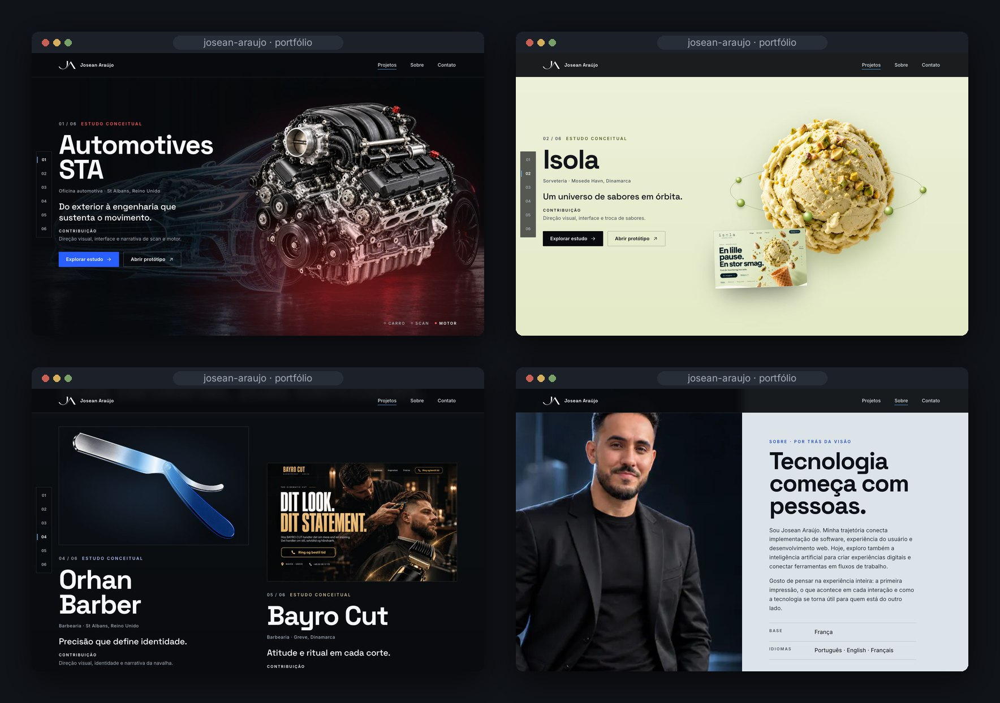
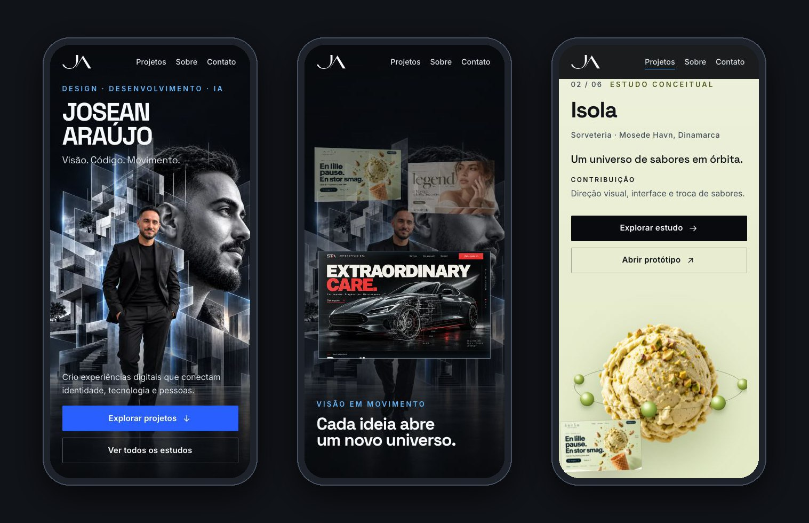

<div align="center">



<h3>A personal portfolio, "Inside the Creative Mind": a monumental portrait opens into planes, six project windows emerge, and the camera goes through one of them into the work.</h3>

<p>
  <a href="#hero-animation"><strong>🎬 How the hero works</strong></a>
  &nbsp;·&nbsp;
  <a href="#the-six-studies"><strong>🗂️ The six studies</strong></a>
  &nbsp;·&nbsp;
  <a href="#getting-started"><strong>🛠️ Run it locally</strong></a>
</p>

<p>
  
  
  
  
  
</p>

</div>

<br />

## 🚀 Overview

This is the portfolio of **Josean Araújo**: design, development and AI. It follows the *Inside the Creative Mind* direction from the art kit: graphite, silver and a contained blue light; large neo-grotesque type; photography, silence and controlled movement. The visitor enters a creative universe. A **monumental portrait** opens into planes while Josean stays in the foreground, **six project windows** emerge from the same architecture, **Automotives STA** takes the centre inside a glass portal, and the camera **goes through the window** into the first study, on the very same image.

From there each study keeps its own identity (the scan of a car, an orbit of flavours, an editorial stroke, a blade of light, a cut of light, a room in layers) inside one recognisable frame. Then the page slows down: who Josean is, how he works, and one way to start a conversation.

- **Cinematic first impression**: a pinned 2.5D scene made of the kit's own layers, with live HTML text over it
- **Six universes, one signature**: every study has a scene, a page of its own and a link to its published prototype
- **Readable without the animation**: the same content in natural order with reduced motion, on short screens and without JavaScript
- **Honest by default**: all six are presented as conceptual studies; no clients, launches, results or ratings are claimed

<br />

<a name="hero-animation"></a>

## 🎬 The hero animation

<div align="center">
  
  <sub>Scroll-scrubbed · captured at 1440 × 900</sub>
</div>

<br />

The stage stays pinned for 360svh on wide screens and follows the five acts of the brief:

| Scroll    | What happens                                                                                                              |
| :-------- | :------------------------------------------------------------------------------------------------------------------------ |
| 0.00–0.12 | **Presence**: the finished art, the name, *Visão. Código. Movimento.*; a silver light runs along the edge of the portrait |
| 0.12–0.32 | **Unfold**: under one band of light the art hands over to its own layers; the glass planes drift apart, the portrait recedes about 5 %, Josean barely moves |
| 0.32–0.55 | **Reveal**: six windows emerge from behind the portrait, three in front and three further back; *Cada ideia abre um novo universo.* with the index 01–06 |
| 0.55–0.76 | **Select**: Automotives STA moves into the glass portal; the other windows lose scale and light                          |
| 0.76–1.00 | **Traverse**: the portal passes the camera, the window straightens to the screen and the blue gives way to the study's red |
| after     | **Car → scan → engine**: the STA chapter opens on the same image; a blue line scans the body, then the engine takes the scene behind a vertical edge |

**Under the hood**

- 🧩 **One smoothed scroll value drives everything.** The scene is a pure function of the scroll position (`render()` in `src/js/hero.js`), so it runs backwards as cleanly as forwards and rebuilds on resize.
- 📐 **Registered with SIFT.** The finished art paints first, then hands over to the transparent layers. The kit says they are not pixel-registered, so `scripts/register-hero.py` finds Josean and the portrait on the art with SIFT keypoints and a RANSAC similarity and writes the result to `src/data/hero.json`. The swap happens under a band of silver light, as the kit asks.
- 🪟 **Real perspective, no 3D engine.** Every window and the step into the portal are projective transforms (`matrix3d`) computed from four corners; the portal's opening was measured on its PNG, so the STA window sits exactly inside it.
- 🎯 **Seamless landing.** On wide screens the STA window takes the screen's own aspect, so when it fills the viewport it is exactly the first frame of the STA chapter. On phones the image opens from the card to the screen with a mask, so nothing is ever stretched.
- 🎛️ **Three modes, picked before the first paint.** `hero-scroll` on wide screens, `hero-compact` on phones and tablets (180svh, three windows), `hero-static` with reduced motion, on short screens (such as 200 % zoom) and without JavaScript.
- ✍️ **Text stays live.** The name, captions and links are HTML over the scene, they only fade and move at most 40 px, and they stay focusable only while visible.

<br />

<a name="the-six-studies"></a>

## 🖥️ Sections

<div align="center">
  
</div>

<br />

| #   | Section                                   | Anchor      | Role                                                                                              |
| :-- | :---------------------------------------- | :---------- | :------------------------------------------------------------------------------------------------ |
| 01  | **Josean Araújo**                         | `#inicio`   | The scene, **Explorar projetos** and a direct way to the list of studies                          |
| 02  | **Automotives STA** · Engenharia e precisão | `#sta`    | The landing of the hero: car → scan → engine, then the case                                       |
| 03  | **Isola** · Sabores em órbita             | `#isola`    | Pistachio light; ingredients orbit the scoop, in front of it and behind it                        |
| 04  | **Legend Nails** · O gesto como assinatura | `#legend` | Cream and olive; the orbit stretches into an editorial stroke across the concept                  |
| 05  | **Orhan Barber** and **Bayro Cut**        | `#orhan`, `#bayro` | *Duas barbearias. Duas identidades.* A blade of light along the razor; a cut of light reveals the next portrait |
| 06  | **M&M Cleaning** · O espaço em camadas    | `#mm`       | Light grey and blue; the room's planes recompose as architecture                                   |
| —   | **Todos os estudos**                      | `#estudos`  | The six studies as a plain list: the way in without the animation                                  |
| 07  | **Tecnologia começa com pessoas.**        | `#sobre`    | A silver pause: Josean at human scale, the text from the brief, base and languages, LinkedIn       |
| 08  | **Da intenção à experiência.**            | `#processo` | Entender → Dar forma → Construir e refinar, with a line that runs through the steps as you read   |
| 09  | **Vamos criar o próximo.**                | `#contato`  | The closing portal and one path: **Conversar no LinkedIn**                                         |

A fixed index (01–06) follows the studies on wide screens; every study also has its own page at `/estudos/<slug>/` with the structure the brief asks for: name and sector, the opportunity, the direction, the interface (the concept mockup, which opens at full size), the movement in up to three states, Josean's role, and the next study.

<br />

## 📱 Mobile first, motion optional

<div align="center">
  
</div>

<br />

- On phones the vertical art keeps Josean whole: the name sits above him, the sentence and the buttons on the floor below him
- A short pinned scene (180svh) brings three windows up and opens the STA image from its card, then the studies follow in a natural vertical flow
- With `prefers-reduced-motion`, on short screens and without JavaScript there is no pinned section: a still hero and every study in order
- Every touch target is at least 44 px, no horizontal scroll at 375 px, and the layout holds at 200 % zoom

<br />

## ✨ Highlights

- **🎞️ One timeline, five acts**: the brief's scroll script, scrubbed with long, soft deceleration and fully reversible
- **🌐 Each study in its own colour**: the page takes on pistachio, cream, platinum, amber light and blue as you move through the work
- **🗂️ Studies as pages**: `npm run studies` writes the six pages and the list from `src/data/projects.js`, so names, sectors and links live in one place
- **♿ Accessible by construction**: skip link, real headings, labelled navigation, visible focus, captions read in order, hidden-until-animated states that only apply once the code that reveals them runs
- **🖼️ Image pipeline**: the kit's PNGs stay the source of truth; WebP sizes, cut layers, project windows, favicon and the social image come from `npm run images`
- **✒️ Sharp monogram**: the JA mark is traced from the kit's PNG into an SVG (`scripts/trace-logo.py`)

<br />

## 💻 Tech stack

| <br />Vite 6 | <br />JavaScript | <br />HTML5 | <br />CSS3 | <br />OpenCV | <br />Python |
| :---: | :---: | :---: | :---: | :---: | :---: |

### Why this stack?

- **Vite + plain JavaScript**: a portfolio doesn't need a framework runtime; the pages are static HTML with small, focused modules (about 8 KB of JavaScript, gzipped)
- **No animation library**: the hero is a pure function of one scroll value; a `requestAnimationFrame` loop, CSS transforms and a few CSS custom properties are all it needs
- **sharp + OpenCV for the assets**: cutting, registering and tracing the kit's images happens once, at build time, not in the browser
- **Self-hosted Space Grotesk and Inter**: the type the brief suggests, with no third-party font requests

<br />

## 🎨 Design system

| Token      | Value                                                                        | Use                                              |
| :--------- | :--------------------------------------------------------------------------- | :----------------------------------------------- |
| Graphite   |  | Page background                                  |
| Surface    |  | Raised panels, the study pages' footer band      |
| Silver     |  | Secondary text, the About pause (14.9:1 on graphite) |
| White      |  | Titles and body (19.3:1 on graphite)             |
| Blue light |  | The narrative light, labels, focus (9.2:1)       |
| UI blue    |  | Primary buttons (white text 5.0:1)               |

- **Type**: Space Grotesk for display, 72–140 px titles on desktop and 40–64 px on mobile; Inter for text, 16–18 px body, labels from 12 px, controls from 14 px
- **Grid**: 12 columns on desktop, 4 on mobile, 6 % margins, 1,440 px content width
- **Rhythm**: 64–160 px between sections
- **Motion**: editorial entrances of 22 px over 700 ms; hover 220 ms with at most 2 % of scale; everything respects `prefers-reduced-motion`

<br />

<a name="getting-started"></a>

## 🛠️ Getting started

```bash
# Clone the repository
git clone https://github.com/Jeanfr1/Myportfolio.git
cd Myportfolio

# Install dependencies (Node 20.9+)
npm install

# Start the dev server  →  http://localhost:5173
npm run dev

# Production build  →  dist/
npm run build

# Preview the production build
npm run preview

# Regenerate the WebP images, favicon and social image from the kit
npm run images

# Rewrite the six study pages and the list of studies from src/data/projects.js
npm run studies

# Optional, Python 3 (opencv-python, numpy, Pillow): re-register the hero layers, re-trace the monogram
python3 scripts/register-hero.py
python3 scripts/trace-logo.py
```

<br />

## 📁 Project structure

```
Myportfolio/
├── index.html                    # Hero → six studies → all studies → about → process → contact → footer
├── estudos/<slug>/index.html     # The six study pages (written by npm run studies)
├── src/
│   ├── main.js · study.js        # Entries: fonts, styles, module init
│   ├── styles/                   # main.css (tokens, hero modes, chapters) · study.css
│   ├── data/
│   │   ├── projects.js           # The six studies: names, sectors, direction, motion, role, prototype links
│   │   └── hero.json             # Layer registration on the hero art (generated by register-hero.py)
│   ├── assets/brand/ja.svg       # The traced JA monogram
│   └── js/
│       ├── hero.js               # The five acts: art → layers, planes, windows, portal, traverse
│       ├── sta.js                # Car → scan → engine
│       ├── scenes.js             # Scroll progress for the other studies' gestures
│       ├── rail.js · header.js · anchors.js · reveal.js · motion.js
├── josean-portfolio-ultrapremium/ # The art kit: references, concepts, hero, layers, projects, roteiros, tokens
├── scripts/
│   ├── optimize-images.mjs       # PNG → WebP, cut layers, project windows, favicon, OG image
│   ├── build-studies.mjs         # Study pages + list from the data
│   ├── register-hero.py          # SIFT registration of the hero layers
│   └── trace-logo.py             # JA monogram → SVG
├── public/                       # Favicon, touch icon, Open Graph image, full-size concepts
└── vercel.json                   # Vite build, one-year cache for hashed assets
```

<br />

## 🚀 Deployment

The site is a static multi-page build and is ready for **Vercel** (`vercel.json` pins the Vite build and caches hashed assets for a year; `.vercelignore` keeps the art kit out of the upload). It is not published yet.

| Setting          | Value           |
| :--------------- | :-------------- |
| Framework        | Vite            |
| Build command    | `npm run build` |
| Output directory | `dist`          |

<br />

## 📌 Content checklist

Each open item is marked `TODO(portfolio)` in the code.

- [ ] Approve the About text and the hero sentence (both come from the roteiro; no years, titles or awards are added)
- [ ] Confirm that the six **published prototypes** should be linked from the portfolio (`prototype` in `src/data/projects.js`; `null` hides a link)
- [ ] Email, GitHub and WhatsApp: add them only once the real addresses are confirmed; LinkedIn stays the main path
- [ ] A bilingual version (EN / FR) translating navigation, studies and contact in full
- [ ] A concept mockup for M&M Cleaning (the kit has the room, not the page)
- [ ] Domain (then add `canonical` and `og:url`, and make `og:image` absolute)
- [ ] Optional: a produced 3D model or frame sequence for a truly volumetric camera, as the kit notes

<br />

## 🙏 Acknowledgments

- The *Inside the Creative Mind* art kit: direction, concepts, layers and roteiros
- **[Space Grotesk](https://fonts.google.com/specimen/Space+Grotesk)** by Florian Karsten and **[Inter](https://rsms.me/inter/)** by Rasmus Andersson (both OFL)
- **[sharp](https://sharp.pixelplumbing.com)** and **[OpenCV](https://opencv.org)** for the asset pipeline
- **[Vite](https://vite.dev)**

<br />

---

<div align="center">
  
  <p><strong>Visão. Código. Movimento.</strong></p>
  <p>Built with ❤️ by <a href="https://github.com/Jeanfr1">Jean</a></p>
  <sub>© 2026 Josean Araújo. The six projects shown are conceptual design studies.</sub>
</div>
